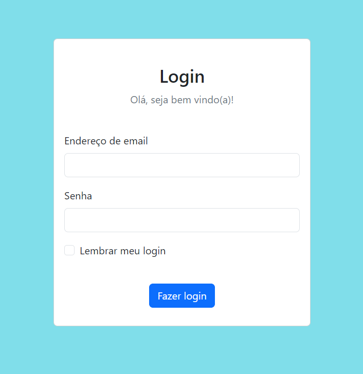

# Session

## Descrição
Esse é um exemplo do uso de cookies em um sistema de login, feito em aula utilizando PHP e HTML. A interface do site foi feita em HTML, utlizando Bootstrap, e a configuração dos cookies foi feita em PHP.
A primeira página a ser aberta pelo usuário é a que contém a tela de login, após a autenticação, uma página secundária será aberta mostrando uma mensagem de boas vindas ao usuário, e informando o endereço de email e a senha armazenados nos cookies. 

## Demonstração

    

